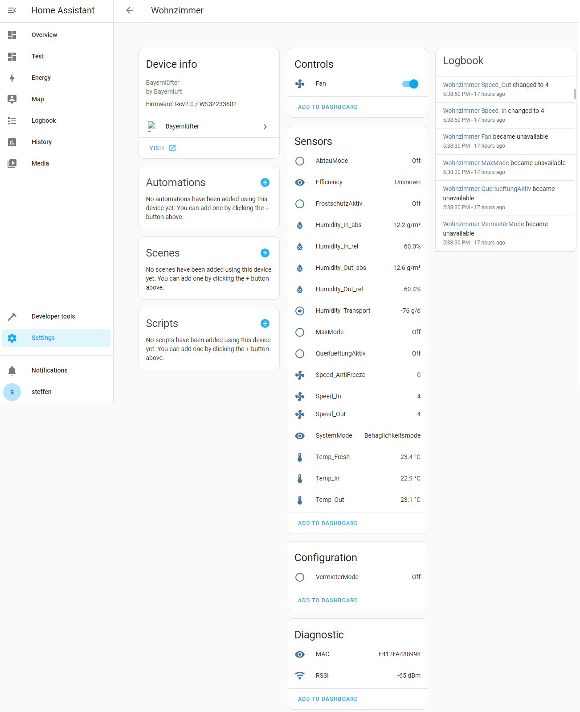
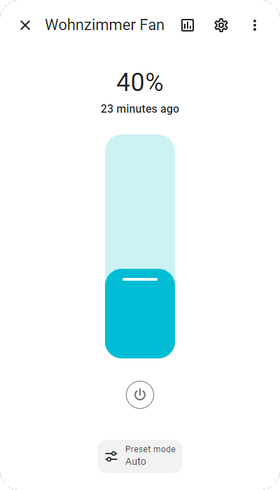

# Bayernlüfter

This component adds support for [Bayernlüfter](https://www.bayernluft.de) devices to Home Assistant:

If you like this component, please give it a star on [github](https://github.com/mampfes/ha_bayernluefter).

## Installation

1. Ensure that [HACS](https://hacs.xyz) is installed.
2. Install **Bayernlüfter** integration via HACS.
3. Add **Banyernfüter** integration to Home Assistant (one per device):

   

In case you would like to install manually:

1. Copy the folder `custom_components/bayernluefter` to `custom_components` in your Home Assistant `config` folder.
2. Add **Bayernlüfter** integration to Home Assistant (one per device):

   

